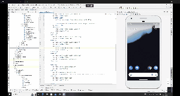
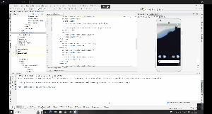
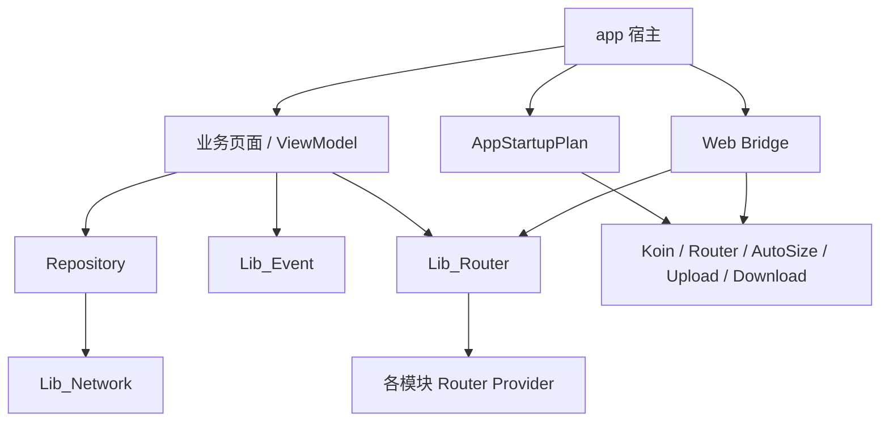

# KotlinMvvm

一个面向 Android 的模块化 MVVM 示例项目，当前代码已经在原有基础上补充了这些核心能力：

- `Koin + KSP` 依赖注入
- `TheRouter` 跨模块页面/服务路由
- `AndroidAOP` 横切能力治理
- 启动任务分阶段编排
- `EventChannel` 轻量级 Flow 事件总线
- Web Bridge、下载、上传、网络抓包等基础设施模块

这份 `README` 只描述当前代码库的真实状态，旧版以 `ARouter`、传统 Application 全量初始化为中心的说明已经不再适用。

## 项目截图

| 项目截图 | 项目截图 | 项目截图 |
| :---: | :---: | :---: |
|  |  |  |

## 文档导航

| 文档 | 说明 |
| --- | --- |
| [docs/architecture.md](docs/architecture.md) | 整体架构、模块职责、启动链路、依赖流向 |
| [docs/feature-development.md](docs/feature-development.md) | 新增页面、模块、路由、Bridge 能力时的标准接入流程 |
| [docs/koin-aop-guide.md](docs/koin-aop-guide.md) | Koin、AOP、Router 的使用约定与常见注意事项 |

## 当前技术栈

- 语言与并发：`Kotlin`、`Coroutines`
- 架构：`MVVM`、模块化、`ViewBinding`
- DI：`Koin 4`、`Koin Annotations`、`KSP`
- 路由：`TheRouter`
- AOP：`AndroidAOP`
- 网络：`Retrofit`、`OkHttp`
- 存储：`MMKV`、`Room`
- UI：`Material`、`SmartRefreshLayout`、`AutoSize`
- 启动优化：`core-splashscreen`、自定义 `StartupTaskRunner`
- 事件通信：`EventChannel`

## 模块结构

| 模块 | 角色 |
| --- | --- |
| `app` | 宿主壳工程，收口 Application、启动计划、应用级 Koin 模块、首页与 Web 能力 |
| `Lib_Base` | 基类体系、启动任务调度、通用 AOP、Web Bridge 基础设施 |
| `Lib_Router` | 路由契约、语义化 `AppRouter`、跨模块 Provider、路由 AOP |
| `Lib_Network` | 网络封装、`NetworkApiFactory`、公共请求能力 |
| `Lib_Event` | 基于 Flow 的轻量事件总线 |
| `Lib_UI_Common` | Toast、通用 UI 扩展与公共表现层能力 |
| `Lib_Utils` | 工具方法与基础通用组件 |
| `Lib_Download` | 下载领域模型、调度器、Bridge 下载载荷、对外下载服务 |
| `Lib_Upload` | 上传领域模型、引擎、文件选择宿主、Bridge 上传载荷 |
| `module_login` | 登录业务模块，提供登录页、登录仓库、登录 Bridge 能力 |
| `Feature_Capture` | 网络抓包模块，提供抓包页面、拦截器、Provider 与 Bridge 能力 |

## 整体架构



更完整的说明见 [docs/architecture.md](docs/architecture.md)。

## 关键设计点

### 1. Application 只保留轻量初始化入口

- `BaseApplication` 不再在 `onCreate` 中堆满初始化
- 基础运行时通过 `ensureBaseRuntimeInitialized()` 延后执行
- 应用启动任务统一由 `AppStartupPlan` 分阶段调度

### 2. Koin 统一负责对象装配

- `@Single` 用于 Repository / Service / Bridge Module 等单例依赖
- `@KoinViewModel` 用于页面 ViewModel
- `@Module + @ComponentScan` 用于模块级自动扫描
- `appModules` 统一汇总所有业务与基础模块

### 3. Router 只暴露语义化能力，不直接散落字符串跳转

- 路由常量放在 `Lib_Router/RouterPath.kt`
- 路由契约放在 `Lib_Router/*Router.kt`
- 各模块通过 `@ServiceProvider` 提供具体实现
- 业务侧优先通过 `AppRouter` 调用，不直接到处 `TheRouter.build(...)`

### 4. AOP 负责横切治理

当前已经落地的典型能力包括：

- `@PreventRepeat`：防重复点击/重复触发
- `@LoginRequired`：登录守卫与登录后恢复
- `@RequireNetwork`：网络可用性校验
- `@TraceTime`：同步/挂起函数耗时统计
- `@RequireCameraPermission` / `@RequireImageReadPermission`：权限请求
- `@FeatureEnabled`：特性开关控制
- `@DebugOnly`：仅 Debug 环境可用

## 新增功能的推荐流程

1. 先确认功能归属到 `app` 还是某个业务模块。
2. 页面层优先继承 `BaseActivity` 或 `BaseFragment`。
3. 页面依赖统一交给 `@KoinViewModel` + `@Single` 注入。
4. 跨模块跳转先在 `Lib_Router` 定义契约，再由模块提供 Provider。
5. 登录、权限、防抖、网络校验等统一优先使用现成 AOP 注解。
6. 只有首屏强依赖的初始化才放进 `BLOCKING_MAIN`，其他能力尽量首帧后执行。

更细的模板和示例见 [docs/feature-development.md](docs/feature-development.md)。

## 常用命令

```bash
./gradlew :app:assembleDebug
./gradlew :app:compileDebugKotlin :app:processDebugResources
```

## 补充说明

- 如果要新增模块、AOP 注解或 Bridge 能力，建议先阅读 `docs` 目录下的三份文档

## 致谢

项目中使用到的主要开源组件包括：

- [Retrofit](https://github.com/square/retrofit)
- [OkHttp](https://github.com/square/okhttp)
- [Glide](https://github.com/bumptech/glide)
- [MMKV](https://github.com/Tencent/MMKV)
- [SmartRefreshLayout](https://github.com/scwang90/SmartRefreshLayout)
- [TheRouter](https://github.com/HuolalaTech/hll-wp-therouter-android)
- [Koin](https://github.com/InsertKoinIO/koin)
- [AndroidAOP](https://github.com/FlyJingFish/AndroidAOP)
