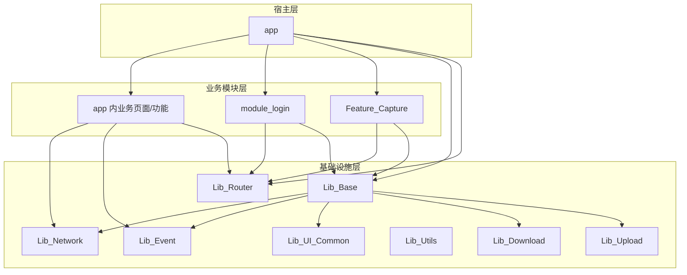

# 项目架构说明

这份文档聚焦三个问题：

1. 这个项目现在分成了哪些层和模块。
2. 页面、依赖、路由、启动任务是怎么串起来的。
3. 新能力应该落到哪里，而不是继续堆在 `app` 或 `Application` 里。

## 1. 分层视角



## 2. 模块职责建议

| 模块 | 应该放什么 | 不建议放什么 |
| --- | --- | --- |
| `app` | 宿主入口、应用级模块装配、首页聚合能力、启动计划 | 大量独立业务细节、跨模块通用能力 |
| `Lib_Base` | Activity/Fragment/ViewModel 基类、启动框架、通用 AOP、Bridge 框架 | 具体业务页面 |
| `Lib_Router` | 路由协议、`AppRouter` 门面、AOP 导航守卫 | 具体页面实现 |
| `Lib_Network` | 请求工厂、公共网络封装 | 具体业务仓库 |
| `Lib_Event` | 全局事件通信 | 业务状态持久化 |
| `Lib_UI_Common` | Toast、通用 UI 组件与展示辅助能力 | 业务域数据逻辑 |
| `Lib_Utils` | 通用工具类、基础扩展 | 复杂业务编排 |
| `Lib_Download` | 下载领域模型与执行引擎 | 宿主业务页面 |
| `Lib_Upload` | 上传领域模型与执行引擎 | 宿主业务页面 |
| `module_login` | 登录页面、登录仓库、登录相关 Bridge 能力 | 与登录无关的主页逻辑 |
| `Feature_Capture` | 抓包页面、抓包拦截器、抓包 Provider | 业务首页逻辑 |

## 3. UI 到数据的标准链路

典型链路如下：

```text
Activity / Fragment
  -> ViewModel(@KoinViewModel)
  -> Repository(@Single)
  -> NetworkApiFactory
  -> Retrofit Service
```

当前页面层统一建立在这些基类之上：

- `BaseCoreActivity`：初始化 `ViewBinding`、`TheRouter.inject(this)`、Koin ViewModel 解析
- `BaseActivity`：补充标题栏、通用系统栏、Dialog、导航事件监听
- `BaseCoreFragment`：初始化 `ViewBinding`、Koin ViewModel、首启懒加载
- `BaseFragment`：补充标题栏、Dialog、导航事件监听
- `BaseViewModel`：统一承接导航、生命周期、UI 事件、协程作用域

这套设计意味着页面新增时，通常不需要手写 ViewModelFactory，也不需要在页面里自己拼装 Repository。

## 4. Koin 装配链路

### 4.1 模块定义

- 应用级扫描入口：`app/src/main/java/com/ghn/cocknovel/di/AppModule.kt`
- 业务模块扫描入口：例如 `module_login/.../LoginModule.kt`
- 模块汇总入口：`app/src/main/java/com/ghn/cocknovel/di/KoinModules.kt`

### 4.2 当前约定

- `@Single`：单例仓库、单例服务、Bridge Module、能力 Provider
- `@KoinViewModel`：页面 ViewModel
- `@Module + @ComponentScan`：一个业务模块的扫描入口
- 手写 `downloadModule`、`uploadModule`：补充接口到实现的绑定

### 4.3 为什么这么做

- 避免在 `Application` 里手写大量 `single { ... }`
- 避免模块之间的装配入口分散
- 让模块天然可以独立演进和迁移

## 5. 路由设计

项目的跨模块路由不是直接四处写字符串，而是分成三层：

### 5.1 路由常量层

- 放在 `Lib_Router/RouterPath.kt`
- 只负责定义路径常量

### 5.2 路由契约层

- 放在 `Lib_Router/*Router.kt`
- 只定义“能做什么”，不关心“怎么跳”

例如：

```kotlin
interface LoginRouter {
    fun openLogin(loginRequestId: String? = null, context: Context? = null)
}
```

### 5.3 路由实现层

- 放在实际拥有页面的模块里
- 通过 `@ServiceProvider(returnType = XxxRouter::class)` 暴露能力

例如登录模块的 `LoginNavigatorProvider` 负责真正跳到登录页。

### 5.4 门面层

- `AppRouter` 给业务层提供语义化调用入口
- 业务代码优先调用 `AppRouter.openSettings()` 这类语义函数
- 不建议在 ViewModel / Fragment 中直接到处写 `TheRouter.build(...)`

这样做的好处是：

- 跨模块只依赖协议，不依赖实现类
- 后续调整页面路径时，影响面更可控
- AOP 守卫可以直接挂在语义化入口上

## 6. AOP 设计

项目把高频横切逻辑集中在两处：

- `Lib_Base`：通用能力，如耗时、权限、网络
- `Lib_Router`：与路由/登录/环境/功能开关强相关的切面

典型注解：

| 注解 | 用途 |
| --- | --- |
| `@TraceTime` | 统计同步或 `suspend` 函数耗时 |
| `@RequireNetwork` | 无网络时阻断动作 |
| `@PreventRepeat` | 防重复点击、防重复触发 |
| `@LoginRequired` | 未登录时拦截，并可登录后恢复 |
| `@FeatureEnabled` | 特性开关控制 |
| `@DebugOnly` | 仅 Debug 环境开放 |
| `@RequireCameraPermission` | 自动申请相机权限 |
| `@RequireImageReadPermission` | 自动申请图片读取权限 |
| `@MarkLoginSuccess` | 登录成功后恢复挂起动作 |

设计目标不是“为了 AOP 而 AOP”，而是把这些本来会分散在每个点击事件、每个页面方法里的样板逻辑收口。

## 7. 启动链路

启动被拆成两段：

### 7.1 Base 运行时初始化

`BaseApplication.ensureBaseRuntimeInitialized()` 负责：

- `MMKV`
- 网络头与 `RetrofitClient`
- `NetServiceFactory`
- `NetConfigHelper`
- `EventChannel` 错误处理

这部分只在真正需要时触发，不再全部堆在 `Application.onCreate()`。

### 7.2 App 启动计划

`AppStartupPlan` 负责更高层的应用初始化，并通过 `StartupTaskRunner` 按阶段调度：

| 阶段 | 说明 | 当前任务示例 |
| --- | --- | --- |
| `BLOCKING_MAIN` | 首屏前必须完成 | `koin`、`autosize`、`router` |
| `AFTER_FIRST_FRAME_MAIN` | 首帧后主线程补齐 | `toast`、下载上传配置、刷新布局默认配置 |
| `AFTER_FIRST_FRAME_BACKGROUND` | 首帧后后台预热 | 下载/上传能力预热 |

这套分层的目的，是避免“所有初始化都抢冷启动主线程”。

## 8. Web Bridge 的位置

Web Bridge 相关能力分两层：

- `Lib_Base`：Bridge 抽象、模块注册、回调与宿主能力
- 各业务模块：通过 `AnnotatedWebBridgeModule` 提供自己的指令集

例如：

- `AppWebBridgeModule`：通用页面关闭、上下文读取、路由打开、权限申请
- `LoginWebBridgeModule`：登录模块桥接能力
- `CaptureWebBridgeModule`：抓包模块桥接能力

所以如果后续要给 H5 增加新能力，通常不需要改 Bridge 基座，只需要新增一个模块实现。

## 9. 新代码应该放哪

| 需求 | 推荐位置 |
| --- | --- |
| 新页面 Activity/Fragment | 所属业务模块的 `ui/activity` 或 `ui/fragment` |
| 页面 ViewModel | 所属业务模块的 `viewmodel` |
| 接口访问仓库 | 所属业务模块的 `repository` |
| 跨模块跳转协议 | `Lib_Router` |
| 跨模块跳转实现 | 拥有页面的业务模块 |
| 通用权限/网络/耗时拦截 | `Lib_Base` AOP |
| 登录/功能开关/调试环境守卫 | `Lib_Router` AOP |
| 下载上传核心能力 | `Lib_Download` / `Lib_Upload` |
| Web Bridge 指令 | 所属业务模块的 `ui/web` 或 `web` |

## 10. 进一步阅读

- 新增功能怎么接入： [feature-development.md](feature-development.md)
- Koin / AOP 的具体用法： [koin-aop-guide.md](koin-aop-guide.md)
